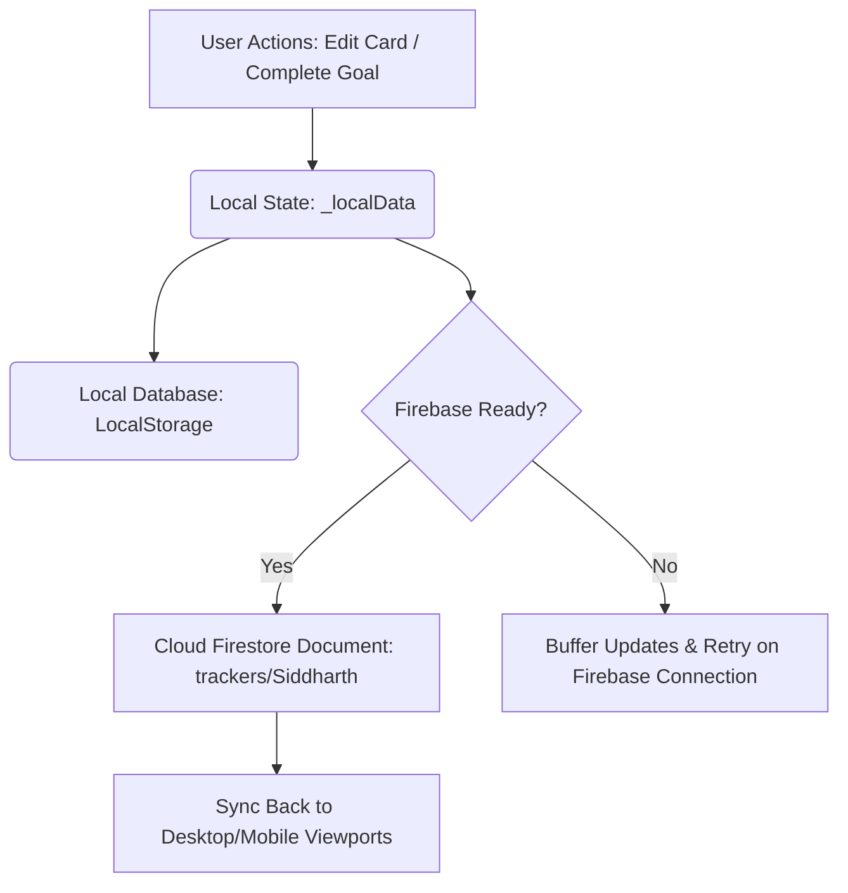

# Blueprint: System Architecture & Technical Walkthrough

A high-fidelity, premium personal tracking system and goal engine designed to manage career objectives, target companies, key outreach contacts, job portals, and daily focus blocks. This document serves as the comprehensive guide to how **Blueprint** has been engineered and how it operates under the hood.

---

## 🚀 1. Executive Summary & Strategy
**Blueprint** is built to govern progress toward a single, high-stakes objective: landing a **$200k Senior Design Job in NYC by February 2027**. 

To maintain momentum and resist context-switching, the application combines productivity theory (Notion-inspired visual hierarchy) with ADHD-defensive psychological cues. It provides real-time progress diagnostics, diagnostic "Zone" checks, customizable target contact lists, and dynamic data charts.

---

## 🛠️ 2. Core Technology Stack
The application is built entirely on a highly performant, client-side serverless architecture:

*   **Core Logic & Engine**: Vanilla JavaScript (ES6+ modular logic) providing instantaneous view state updates and zero compile-time overhead.
*   **Structure & Markup**: HTML5 Semantic markup (`index.html`) featuring modular layouts and highly structured routing zones.
*   **Styling System**: CSS3 Custom Properties (`style.css`) leveraging dark-mode styling variables, glassmorphic overlays, translucent border tokens, and responsive transitions.
*   **Database & Cloud Sync**: Firebase Firestore (SDK v10.12.2) for real-time document sync across mobile/desktop, backed by a robust `LocalStorage` local database buffer.
*   **Data Visualizations**: Chart.js (v4.4.2) for real-time rendering of goal progress donuts and weekly bar-graph wins trackers.
*   **Iconography**: Phosphor Icons (Universal icon set) for high-fidelity visual representations.

---

## 🗄️ 3. Database Schema & Data Models
Data is stored as a single JSON document inside the Firebase collection `trackers` under the document ID `Siddharth`. Below is the complete schema definition:

```json
{
  "version": 3,
  "settings": {
    "startDate": "2026-06-01T00:00:00",
    "endDate": "2027-02-28T23:59:59",
    "totalHours": 6480,
    "userName": "Siddharth",
    "targetSalary": 200000,
    "targetLocation": "New York City"
  },
  "goals": [
    { "id": "g1", "type": "daily", "text": "Apply to 3 NYC Design Roles", "completed": false }
  ],
  "archive": [
    {
      "id": "g1_arc_1779600000000",
      "text": "File for CIC Competition",
      "type": "weekly",
      "completedAt": "2026-05-23T23:12:00.000Z"
    }
  ],
  "companies": [
    {
      "name": "Notion",
      "description": "Design-first product, gold standard.",
      "fields": [
        { "label": "LinkedIn", "value": "https://linkedin.com/company/notion" }
      ]
    }
  ],
  "people": [
    {
      "name": "Sana Maqsood",
      "description": "Lead UX Designer @ Amazon",
      "fields": [
        { "label": "LinkedIn", "value": "https://linkedin.com/in/sana-maqsood" },
        { "label": "Email", "value": "sana@amazon.com" },
        { "label": "Phone", "value": "+1-555-0199" }
      ]
    }
  ],
  "portals": [
    {
      "name": "LinkedIn Jobs",
      "fields": [
        { "label": "Link", "value": "https://linkedin.com/jobs" }
      ]
    }
  ],
  "coach": {
    "weaknesses": ["ADHD Distractions", "Time Management"],
    "strengths": ["Visual Craft", "Interaction Design"],
    "reminders": ["Your ADHD means it takes 1-3 hours to focus. Start early."]
  },
  "journal": []
}
```

---

## 🗺️ 4. Detailed Module Architecture

### A. Add New Goal (Scroll-Free Entry Form)
*   **UX Enhancement**: Moved from the bottom of the page directly to the **top** of the Goals view. This guarantees that entering new items requires zero scroll effort.
*   **Form Mechanics**: Uses a standard HTML input and select dropdown styled with custom borders. Pressing **"Add Goal"** pushes a new active goal to the database, auto-renders, and shifts focus back to the text field instantly.

### B. Goals Tracker & Checkbox Mechanics
*   **Separated Labels**: Swapped HTML `<label>` tags with standard `<span>` tags. Clicking on a goal's text now focuses the selection, letting you select, highlight, and copy goal descriptions at any time. Toggling completion is locked exclusively to clicking the literal checkbox.
*   **Archiving**: When a checkbox is checked, the goal is moved from the active `goals` array into the `archive` history database with a `completedAt` timestamp.
*   **The Undo Engine**: When archived, the application stores the original goal in memory and pops an interactive success toast:
    ```html
    Goal completed! 🏆 <span onclick="window._undoLastArchive()">Undo</span>
    ```
    Clicking **"Undo"** pops the goal out of the archive and inserts it back into the active database, refreshing all stats and progress grids in real time.

### C. Target Board & Sources (Tabbed Grid Layout)
*   **The Overcoming of Crowding**: Transformed the cramped three-column layout (Companies, Key Contacts, and Job Portals side-by-side) into a highly polished **Pill-Tabbed System**.
*   **Space-Efficient Grid**: Switching a tab renders the items in a responsive CSS Grid:
    ```css
    display: grid;
    grid-template-columns: repeat(auto-fill, minmax(320px, 1fr));
    gap: 16px;
    ```
    This completely prevents horizontal card squishing and vertical overflows.
*   **Customizable Field Matrices (Up to 10 Inputs)**:
    *   Cards are no longer limited to fixed values. Clicking **"+ Add Field"** dynamically adds a new input row to any card (up to 10 maximum).
    *   Dropdown selectors let you select category labels: **LinkedIn**, **Link**, **Email**, **Phone**, **GitHub**, **Twitter**, or **Other**.
    *   **Contextual Direct-Action Tags**: The application parses the values to generate automated direct links: `mailto:` for Email fields, `tel:` for Phone fields, and standard `https://` formatting for URLs.
    *   **Dynamic Visual Icons**: Input row icons update in real time as the user switches dropdown options, displaying appropriate Phosphor Icons.
*   **HTML5 Drag-and-Drop Reshuffling**:
    *   Cards have `draggable="true"` set. Dragging cards in any direction allows reordering their custom placement inside the grid.
    *   **Draggability Blocker**: If the user's cursor is focused inside an editable text element or dropdown inside a card, dragging is automatically blocked to allow seamless writing and text selection without triggering a drag.
    *   **Visual Hover Cues**: Active card gets styled with a dashed purple accent outline, reduced opacity (`0.45`), and scale down (`0.98`). Target destination cards light up with a glowing shadow:
        ```css
        box-shadow: 0 0 10px rgba(167, 139, 250, 0.25);
        transform: translateY(-2px);
        ```

---

## 🎨 5. Design System Tokens
The application is governed by a dark-mode, Notion-inspired design tokens system defined in `:root` of `style.css`:

| Token | CSS Color Value | Application Area |
| :--- | :--- | :--- |
| `--bg-base` | `#191919` | Main application background surface |
| `--bg-surface` | `#202020` | Cards, sidebars, list columns, inputs |
| `--bg-card` | `#191919` | Individual target card backgrounds |
| `--border` | `rgba(255, 255, 255, 0.08)` | Subtle border separators |
| `--border-strong` | `rgba(255, 255, 255, 0.15)` | Active fields, buttons, input hover states |
| `--text-primary` | `rgba(255, 255, 255, 0.9)` | Titles, labels, active values |
| `--text-secondary` | `rgba(255, 255, 255, 0.5)` | Body text, subheadings, field value labels |
| `--accent` | `#a78bfa` | Primary brand purple. Highlights active elements |
| `--accent-soft` | `rgba(167, 139, 250, 0.15)` | Tab badges, subtle hover highlights |
| `--accent-hover` | `#8b5cf6` | Button hovering overlays |
| `--danger` | `#f85149` | Removal buttons, danger zone diagnostics |

---

## 🔄 6. Data Synchronization Flow
The data flow guarantees **100% offline-first reliability** and real-time multiplayer synchronization:



---

## ⚙️ 7. Vercel Hosting & Domain Configuration
The application is hosted globally on Vercel's edge network. The primary configuration highlights are:

*   **Repository Connection**: Connected directly to the GitHub repository: `https://github.com/sidfolio/Tracker.git`.
*   **Root Directory**: Set cleanly to `./` inside the Vercel project settings, ensuring the application compiles from the primary workspace layout.
*   **Custom Domain Routing**:
    *   **Primary Active URL**: [https://growthblueprint.vercel.app](https://growthblueprint.vercel.app)
    *   **Default Vercel URL**: `https://tracker-two-roan.vercel.app` (unblocked and actively serving production views).
    *   **Custom Apex Domain Configuration**: Apex custom domains like `blueprint.io` can be attached by registering an **A Record** pointing to `76.76.21.21` at the domain registrar.
